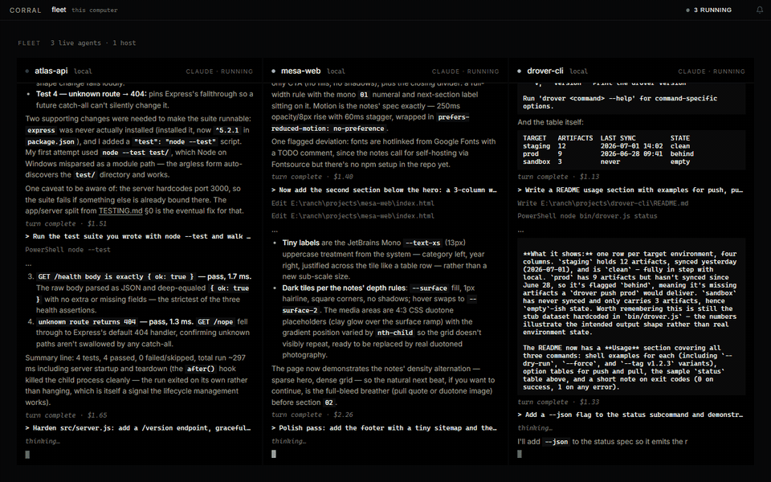

# corral

**Ranch your AI coding agents.** Every host in your `~/.ssh/config` becomes part of the herd —
run Claude, Codex, and OpenCode sessions on any of them, watch the whole fleet work live in one
dark console, and get buzzed on your phone when an agent needs a decision.



- **Fleet view** — every running agent as a live streaming tile, across all your machines at once.
- **One window for the whole ranch** — chats, file browser, git diffs, terminals, SSH tunnels.
- **Your ssh config is the setup** — if `ssh myhost` works, `corral` can ranch agents there. No
  daemons to install on remotes.
- **Phone push** — "Claude needs you" lands on your phone via [ntfy](https://ntfy.sh) (or your
  self-hosted relay) while you're away from the desk.
- **Operator calm** — a dashboard that answers "what's running, what's waiting on me, what broke"
  and stays quiet about everything else.

## Install

Grab the installer for your OS from [Releases](../../releases) — `.dmg` (macOS, Apple silicon +
Intel), `.exe` (Windows), `.AppImage`/`.deb` (Linux).

> Builds are currently unsigned. macOS: right-click the app → **Open** the first time.
> Windows: SmartScreen → **More info** → **Run anyway**.

Or run from source in under a minute (Node 20+):

```sh
git clone https://github.com/Mapika/corral && cd corral
npm install
npm run dev        # opens on http://localhost:5173
```

Agents are the CLIs you already have: [`claude`](https://claude.com/claude-code), `codex`, or
`opencode` on your PATH (locally, and on any remote host you want to ranch). Corral runs them
under your existing login — it never touches API keys.

## Phone notifications

Click the bell in the titlebar: pick a topic, install the ntfy app, subscribe. Corral pushes
"needs a decision", "turn complete", and "died unexpectedly" — with a cooldown, and never for
sessions you ended yourself. Works with ntfy.sh or any self-hosted ntfy; headless runs can set
`CORRAL_NTFY_TOPIC` / `CORRAL_NTFY_SERVER` instead.

## Security model (short version)

The backend binds **loopback only** and is gated by a **per-run token** minted by the desktop
shell. Remote operations are restricted to hosts from your ssh config; every remote argument is
shell-escaped and every local spawn uses argv arrays, never a shell string. Agent permission
modes that bypass prompts are refused outright. The full threat model lives in
[SECURITY.md](SECURITY.md).

## Development

```sh
npm run dev        # Vite frontend with HMR + auto-started backend  -> http://localhost:5173
npm start          # Node backend alone                             -> http://127.0.0.1:7878 (serves built dist/)
npm run build      # build the Svelte app into dist/
npm test           # backend selftest + frontend unit tests
npx tauri dev      # the packaged desktop app (Rust shell + Node sidecar)
npx tauri build    # produce installers locally
```

### Layout

```
server.js            Node backend: HTTP + WebSocket, auth/origin gate, file & tunnel APIs
chat.js              agent session lifecycle — local process or `ssh host …`
agents/              adapters: claude (stream-json), codex (app-server), opencode (HTTP)
push.js              phone push via ntfy-compatible relays
tunnels.js           `ssh -L` port-forward management
web/                 Svelte 5 frontend (Vite)
src-tauri/           Rust desktop shell: mints the auth token, runs server.js as a sidecar
DESIGN.md            the "Ink" visual system    SECURITY.md   threat model
```

(Formerly "agent rancher" / "codapp" — legacy `CODAPP_*` env vars and an existing `~/.codapp`
data dir keep working.)

## License

[MIT](LICENSE) © Mark Marosi ([@Mapika](https://github.com/Mapika))
