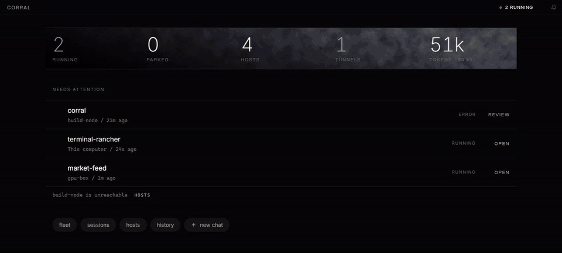
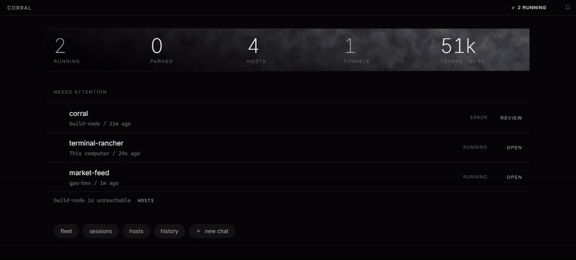
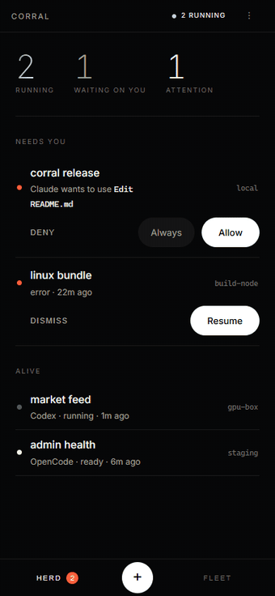

# corral

**Ranch your AI coding agents.** Every host in your `~/.ssh/config` becomes part of the herd —
run Claude, Codex, and OpenCode sessions on any of them, watch the whole fleet work live in one
dark console, and get buzzed on your phone when an agent needs a decision.



- **Fleet view** — every running agent as a live streaming tile, across all your machines at once.
- **One window for the whole ranch** — chats, file browser, git diffs, terminals, SSH tunnels.
- **Your ssh config is the setup** — if `ssh myhost` works, `corral` can ranch agents there. No
  daemons to install on remotes.
- **Phone push** — "Claude needs you" lands on your phone while you're away from the desk:
  Web Push straight from your Corral (no relay, end-to-end encrypted), or an
  [ntfy](https://ntfy.sh)-compatible relay if you prefer.
- **A real phone app** — pair the Android app (or your phone's browser) with a QR code and run
  the ranch from the couch: answer permission prompts with one tap, watch the fleet stream live,
  launch new agents.
- **Operator calm** — a dashboard that answers "what's running, what's waiting on me, what broke"
  and stays quiet about everything else.

## What it actually does

Browse a session's working directory and inspect the diff without leaving the app.



Forward a remote service to localhost, then copy or open it.


## Install

Grab the installer for your OS from [Releases](../../releases) — `.dmg` (macOS, Apple silicon),
`.exe` (Windows), `.AppImage`/`.deb` (Linux), `.apk` (Android — the phone companion, see below).
Intel Mac users can build from source for now.

> Builds are currently unsigned. macOS: right-click the app → **Open** the first time.
> Windows: SmartScreen → **More info** → **Run anyway**.

Or run from source in under a minute (Node 20+):

```sh
git clone https://github.com/Mapika/corral && cd corral
npm install
npm run dev        # opens on http://localhost:5173
```

Agents are the CLIs you already have: [`claude`](https://claude.com/claude-code), `codex`, or
`opencode` on your PATH (locally, and on any remote host you want to ranch). Corral runs them
under your existing login — it never touches API keys.

## The phone app



Click the phone icon in the titlebar, enable **remote access**, and scan the QR:

- **With the Corral Android app** ([Releases](../../releases), `.apk`) — scan from the pairing
  screen (or paste the link) and you're in.
- **With any camera** — the QR is a plain link; it opens the mobile console in the phone's
  browser, already authenticated. *Add to Home Screen* makes it feel installed. This also works
  on iOS.

The phone gets its own console, built for thumbs: **Herd** (what needs you first — answer an
agent's permission prompt with one tap, resume or dismiss dead sessions), **Fleet** (every live
agent streaming in real time), and **ranch** (launch a new agent on any host, recents first).
Opening a chat gives the full transcript with a docked decision sheet when the agent is waiting,
plus a camera button — snap the whiteboard or an error on another screen and it lands in the
session's working directory, referenced in your message. The console keeps working through
dead spots: a service worker serves the app shell and your last herd snapshot offline.

Pairing uses a durable token separate from the desktop's per-run token; it survives restarts, and
"New code" un-pairs every phone. By default the connection is plain HTTP on your local network —
pair on networks you trust (home Wi-Fi or a [Tailscale](https://tailscale.com) tailnet, which
also makes it work away from home). On a tailnet, run `tailscale cert` and point the pairing
dialog's Transport settings at the PEM pair to serve HTTPS instead. Details in
[SECURITY.md](SECURITY.md).

<br clear="right" />

## Phone notifications

Corral pushes "needs a decision", "turn complete", and "died unexpectedly" — with a cooldown,
and never for sessions you ended yourself. Two transports, same moments:

- **Web Push (no extra app).** On a phone paired over HTTPS, open the console's settings sheet
  and tap **Enable push on this phone**. Your Corral pushes straight to the browser's push
  service — end-to-end encrypted (RFC 8291), no relay, no topic to guard — and a tap lands on
  the session. This rides the one push connection your phone already keeps, so it costs no
  extra battery.
- **ntfy relay.** Click the bell in the titlebar: pick a topic, install the ntfy app, subscribe.
  Works with ntfy.sh or any self-hosted ntfy; headless runs can set `CORRAL_NTFY_TOPIC` /
  `CORRAL_NTFY_SERVER`. Permission asks can carry one-tap Allow/Deny buttons; taps open the
  phone browser, or deep-link (`corral://`) into the Android app with **Tap opens → the Corral
  app**. The app checks for newer releases from its settings sheet.

## Security model (short version)

The backend binds **loopback only** and is gated by a **per-run token** minted by the desktop
shell. Remote operations are restricted to hosts from your ssh config; every remote argument is
shell-escaped and every local spawn uses argv arrays, never a shell string. Agent permission
modes that bypass prompts are refused outright. The full threat model lives in
[SECURITY.md](SECURITY.md).

## Development

```sh
npm run dev        # Vite frontend with HMR + auto-started backend  -> http://localhost:5173
npm start          # Node backend alone                             -> http://127.0.0.1:7878 (serves built dist/)
npm run build      # build the Svelte app into dist/
npm test           # backend selftest + frontend unit tests
npx tauri dev      # the packaged desktop app (Rust shell + Node sidecar)
npx tauri build    # produce installers locally
```

### Layout

```
server.js            Node backend: HTTP + WebSocket, auth/origin gate, file & tunnel APIs
chat.js              agent session lifecycle — local process or `ssh host …`
agents/              adapters: claude (stream-json), codex (app-server), opencode (HTTP)
push.js              phone push via ntfy-compatible relays
remote.js            phone pairing: opt-in LAN listener + durable pairing token
tunnels.js           `ssh -L` port-forward management
web/                 Svelte 5 frontend (Vite); web/src/mobile/ is the phone console
src-tauri/           Rust shell: desktop (token + server.js sidecar) and the Android app
DESIGN.md            the "Ink" visual system    SECURITY.md   threat model
```

(Formerly "agent rancher" / "codapp" — legacy `CODAPP_*` env vars and an existing `~/.codapp`
data dir keep working.)

## License

[MIT](LICENSE) © Mark Marosi ([@Mapika](https://github.com/Mapika))
